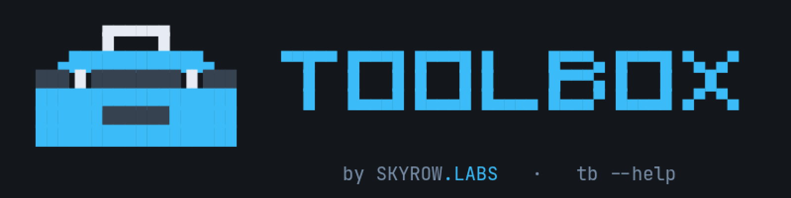

<p align="center">
  
</p>

`tb` is one CLI for watching what other tools are doing — on this machine and across the projects
you keep here.

Four ideas, and everything else follows from them:

- **`tb run` is the only command that acts.** Everything else reads. That line is load-bearing:
  a window may re-run a read on a cadence, because re-running a read is a refresh and re-running
  a write is a scheduler nobody asked for.
- **Commands return data; they never print.** One envelope — `ok` / `partial` / `data` /
  `warnings` — rendered by whoever is consuming it. `--json` on any command gives you the
  envelope itself.
- **tb never parses human output.** `tb data` takes JSON. `tb read` shows what a command printed,
  verbatim, and says that is what it is doing. There is no `--pretty` that guesses.
- **tb is never in the credential path.** External CLIs keep their own authentication.

## Install

```bash
git clone https://github.com/skyrowlabs/toolbox && cd toolbox
python3 -m venv .venv && .venv/bin/pip install -r requirements.txt
ln -s "$PWD/tb" ~/.local/bin/tb          # or run ./tb from the repo
```

Needs Python 3.11+. Shell completion for fish:
`_TB_COMPLETE=fish_source tb > ~/.config/fish/completions/tb.fish`

## The commands

| Command | Does |
|---|---|
| `tb run -- <argv>` | Runs a command and reports what it printed. **The only command that acts** |
| `tb read -- <argv>` | Shows what a command printed, verbatim |
| `tb data -- <argv>` | Reads another CLI's JSON as data, and shapes it into a table |
| `tb follow -- <argv>` | Holds a command's stream open. Any exit is a visible death |
| `tb follow <path>` | Follows a file with a native stat cursor |
| `tb roll-call` | Asks every declared project how it is, and folds the answers |
| `tb tools` | The commands you saved |
| `tb ui` | Opens the canvas — a palette over tiled and floating windows |
| `tb mcp` | Speaks MCP on stdio, offering your saved commands to an agent |

`--` separates tb's flags from the command's own.

## Running something

```console
$ tb run -- echo hello
hello
└ ok · 0.1s · ran 20:03:29 ────────────────────────────────────────────┘
```

The band is on stderr, so `tb run -- x | grep y` still sees exactly what `x` printed.

```console
$ tb read -- printf 'alpha\nbeta\n'
alpha
beta
└ ok · 0.1s · ran 20:03:29 ────────────────────────────────────────────┘
```

## Reading another tool as data

`tb data` parses a tool's JSON and decides how to draw it — which columns are worth showing, which
are prose that belongs on its own line, which are opaque identifiers nobody scans.

```console
$ tb data -- printf '[{"host":"web-1","state":"up","region":"iad"},{"host":"web-2","state":"down","region":"sfo"}]'
● data  table · 2 rows · 3 columns

HOST   STATE  REGION
────────────────────
web-1  up     iad
web-2  down   sfo
```

`table · 2 rows · 3 columns` is the header saying what arrived. Pick columns yourself with
`--cols`:

```console
$ tb data --cols host,state -- printf '[{"host":"web-1","state":"up","region":"iad"},{"host":"web-2","state":"down","region":"sfo"}]'
● data  table · 2 rows · 3 columns

HOST   STATE
────────────
web-1  up
web-2  down
```

Real tools wrap their rows in a mapping, because a bare array has nowhere to put a timestamp.
`--rows` says where they are; without it tb infers only when exactly one value is a list of rows,
and reports rather than guesses when two are.

```console
$ tb data --rows hosts --cols host,state -- printf '{"generated":"2026-08-23T20:00:00Z","hosts":[{"host":"web-1","state":"up"},{"host":"web-2","state":"down"}]}'
● data  object · 2 keys

  generated   2026-08-23T20:00:00Z
hosts  table · 2 rows · 2 columns
  HOST   STATE
  ────────────
  web-1  up
  web-2  down
```

### Nothing is silently wrong

A column you named that no row carries is drawn — "nothing matched" is often the answer — **and
reported**:

```console
$ tb data --cols host,nope -- printf '[{"host":"a"}]'
● data  table · 1 row · 1 column

HOST  NOPE
──────────
a     -
⚠️  no row has this field: nope — drawn empty, in case that is the answer
```

A tool that fails carries its reason, never its output — a failed tool is one whose output should
not be believed:

```console
$ tb data -- sh -c 'echo "boom: no credentials" >&2; exit 3'
✗ data failed
● data  object · 4 keys

  command      sh -c 'echo "boom: no credentials" >&2; exit 3'
  exit_code    3
  duration_s   0.0
  error        boom: no credentials
```

### The envelope

`--json` is a root flag, so it works on every command:

```console
$ tb --json data -- printf '[{"host":"a"}]'
{
  "command": "data",
  "ok": true,
  "partial": false,
  "data": [
    {
      "host": "a"
    }
  ],
  "warnings": [],
  "view": {
    "columns": [
      {
        "key": "host",
        "label": "HOST",
        "flex": 1,
        "min": 4,
        "max": 4
      }
    ],
    "details": [],
    "hidden": []
  }
}
```

**`view` describes how to present `data`; it never filters it.** Every field the tool returned is
still there, so `| jq` keeps what the table chose to hide.

Exit codes: `0` ok, `1` hard failure, `3` partial — not 2, which Click uses for usage errors.

## Following something

Resident by nature. Arrows, PgUp/PgDn and Home scroll back through the ring; `End` returns to
following; `q`, `Esc` or Ctrl-C leaves.

```bash
tb follow -- journalctl -f                    # a stream; any exit is a visible death
tb follow /var/log/nginx/access.log           # a file, by stat cursor
tb follow --due 15m /var/log/cron.log         # past 15m of silence, the band says late
```

The band is the scrollbar:

```
┌ /var/log/cron.log · follow ────────────── quiet 3m of 15m · last write 15:23 ┐
└ 246.4 KiB · showing 41–60 of 200 · parked ───────────────────────────────────┘
```

`--due` is the cron watcher, and it never learned what cron is: a schedule is a declaration, a run
is evidence, and the evidence is the log. You assert an interval; tb subtracts.

## Running something later

```bash
tb run --delay 5m -- ./deploy.sh
```

A countdown you can watch and cancel. `q`, `Esc` or Ctrl-C cancels and nothing ran; so does closing
the terminal. There is no queue, no state file and no unit written — **a command that must outlive
the window wants systemd.** Cancelling exits non-zero, so a script can tell the difference.

## Saving a command

`--save NAME` on `read`, `data` or `follow` saves the invocation and then runs it. It only ever
appends to `~/.config/tb/tools.toml`, and refuses a name that exists — editing and deleting stay
`$EDITOR`'s.

```bash
tb data --cols number,title --refresh 30 --save prs -- gh pr list --json number,title
tb tools prs        # or the short spelling: tb -t prs
```

`tb tools` lists what you saved, and what failed to load. A fresh clone has saved nothing and says
so rather than raising:

```console
$ tb tools
● tools  object · 3 keys

  tools        -
  formats      -
  highlights   -
```

A saved command inherits `acts` from the first word of its argv, so one wrapping `run` is refused a
cadence exactly as `tb run` is — the read/write line survives being given a name.

## Many projects at once

Declare what each project publishes in `~/.config/tb/projects.toml` — a command to ask, or a file
to read:

```toml
[project.jam-sense]
argv = ["jam", "report", "status", "--json"]
cwd  = "~/src/jam.sense"
rows = "jobs"
cols = "job,result,last_age"

[project.house-fly]
path = "~/src/house.fly/tmp/status.json"
```

```bash
tb roll-call
tb roll-call --only jam-sense
```

**tb federates; it never owns.** No ledger, no history, no cache — each project stays the authority
on itself, which is what lets tb stay stateless. A copy of a schedule that agents rewrite goes
stale without announcing it; unreachability is visible, staleness is not.

One project down is `partial`, never blank:

```
jam-sense
  jobs  table · 29 rows · 15 columns
    JOB           RESULT   LAST_AGE
    ───────────────────────────────
    sentinel      red      11h ago
    integration   ok       11h ago

house-fly
    error    No such file or directory
    source   ~/src/house.fly/tmp/status.json

⚠️  house-fly: No such file or directory
```

With nothing declared it says so rather than pretending:

```console
$ TB_HOME=/tmp/empty-tb tb roll-call
● roll-call  object · 0 keys

⚠️  no projects declared — see /tmp/empty-tb/projects.toml
```

## The canvas

```bash
tb ui
```

A command palette over tiled and floating windows. Every command opens a window; a pinned window
re-runs itself on a cadence. **Nothing keeps a command table** — the palette walks the real Click
tree, so it cannot offer a command that does not exist.

The refresh clock lives in Python, keyed to the connection: a browser timer in a hidden tab is
clamped to roughly one fire a minute, so a 5s watcher would silently become a 60s one at the exact
moment you stopped being able to see that it had.

```bash
tb ui --no-browser --port 8765     # develop against it in a browser
```

## Offering it to an agent

```bash
tb mcp
```

Speaks MCP on stdin/stdout — no port, no token, no daemon. Register it with any MCP client:

```json
{"mcpServers": {"toolbox": {"type": "stdio", "command": "tb", "args": ["mcp"]}}}
```

```console
$ printf '%s\n' '{"jsonrpc":"2.0","id":1,"method":"initialize","params":{}}' '{"jsonrpc":"2.0","id":2,"method":"tools/list"}' | tb mcp
```

**An agent reaches the commands you saved, and nothing else.** Every exposed tool has an *empty
input schema* — there is no string an agent can put anywhere. Excluded by rule, not by list:
anything that acts, anything resident, and anything taking a free-form argv.

That last one is the whole safety argument. Choosing `data` over `run` is *your* assertion that
something is a read; an assertion an agent makes about its own argv is not a safety property, it is
a shell with a reassuring name.

## Configuration

| What | Where |
|---|---|
| Saved commands | `~/.config/tb/tools.toml` |
| Capture formats and highlight rules | `~/.config/tb/formats.toml` |
| Declared projects | `~/.config/tb/projects.toml` |
| Canvas browser profile | `~/.local/state/tb/` |

`$TB_HOME` and `$TB_STATE` override the first three and the last. An absent file degrades to
nothing declared rather than raising.

## Development

```bash
.venv/bin/python -m pytest              # the whole suite, no network
.venv/bin/python -m pytest -k readme    # the examples in this file
```

Every `$ tb …` example above is executed by `tests/test_readme.py`, so a README that shows a
command which no longer works fails the build.

`docs/design/fundamentals.md` is the constitution; `docs/features/done/` holds one doc per feature,
each with its rounds and a Notes section that accretes rather than rewrites.
